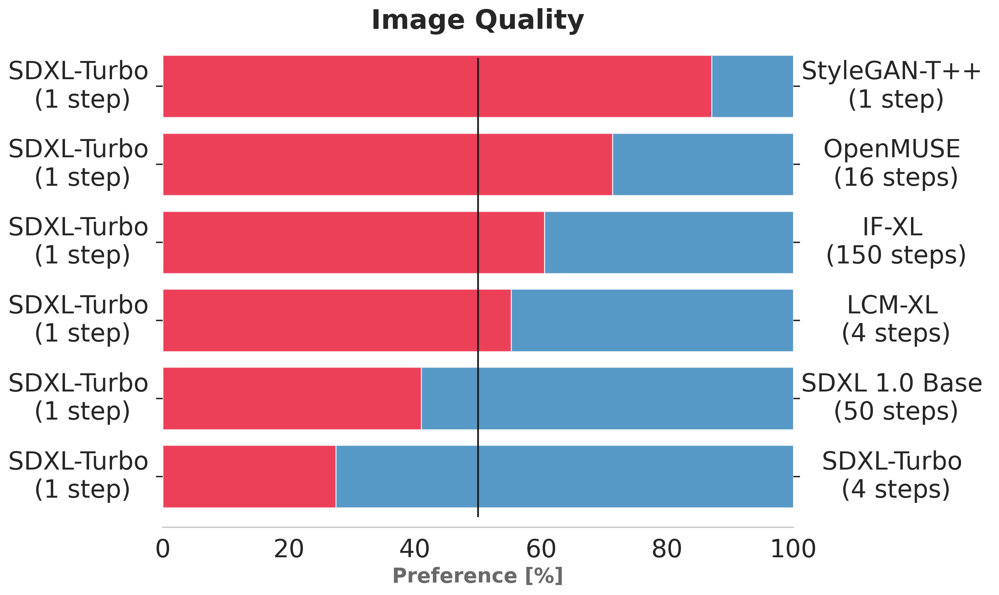
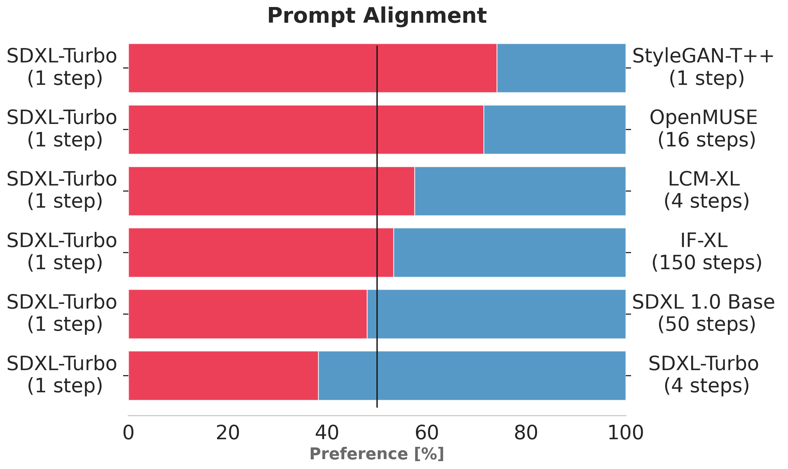

# SDXL-Turbo Model Card

<!-- Provide a quick summary of what the model is/does. -->

SDXL-Turbo is a fast generative text-to-image model that can synthesize photorealistic images from a text prompt in a single network evaluation.
A real-time demo is available here: http://clipdrop.co/stable-diffusion-turbo

## Model Details

### Model Description
SDXL-Turbo is a distilled version of [SDXL 1.0](https://huggingface.co/stabilityai/stable-diffusion-xl-base-1.0), trained for real-time synthesis. 
SDXL-Turbo is based on a novel training method called Adversarial Diffusion Distillation (ADD) (see the [technical report](TODO)), which allows sampling large-scale foundational 
image diffusion models in 1--4 steps at high image quality. 
This approach uses score distillation to leverage large-scale off-the-shelf image diffusion models as a teacher signal and combines this with an
adversarial loss to ensure high image fidelity even in the low-step regime of one or two sampling steps. 

- **Developed by:** Stability AI
- **Funded by:** Stability AI
- **Model type:** Generative text-to-image model
- **Finetuned from model:** [SDXL 1.0 Base](https://huggingface.co/stabilityai/stable-diffusion-xl-base-1.0)

### Model Sources

For research purposes, we recommend our `generative-models` Github repository (https://github.com/Stability-AI/generative-models), 
which implements the most popular diffusion frameworks (both training and inference).

- **Repository:** https://github.com/Stability-AI/generative-models
- **Paper:** TODO
- **Demo:** http://clipdrop.co/stable-diffusion-turbo

## Evaluation

The charts above evaluate user preference for SDXL-Turbo over other single- and multi-step models.
SDXL-Turbo evluated at a single step is preferred by human voters in terms of image quality and prompt following over LCM-XL evaluated at four (or less) steps.
In addition, we see that using four steps for SDXL-Turbo further improves performance.
For details on the user study, we refer to the [research paper](TODO).

## Uses

### Direct Use

The model is intended for research purposes only. Possible research areas and tasks include

- Research on generative models.
- Research on real-time applications of generative models.
- Research on the impact of real-time generative models.
- Safe deployment of models which have the potential to generate harmful content.
- Probing and understanding the limitations and biases of generative models.
- Generation of artworks and use in design and other artistic processes.
- Applications in educational or creative tools.

Excluded uses are described below.

### Out-of-Scope Use

The model was not trained to be factual or true representations of people or events, 
and therefore using the model to generate such content is out-of-scope for the abilities of this model.
The model should not be used in any way that violates Stability AI's [Acceptable Use Policy](https://stability.ai/use-policy).

## Limitations and Bias

### Limitations
- The generated images are of a fixed resolution (512x512 pix), and the model does not achieve perfect photorealism.
- The model cannot render legible text.
- Faces and people in general may not be generated properly.
- The autoencoding part of the model is lossy.

### Recommendations

The model is intended for research purposes only.

## How to Get Started with the Model

Check out https://github.com/Stability-AI/generative-models

